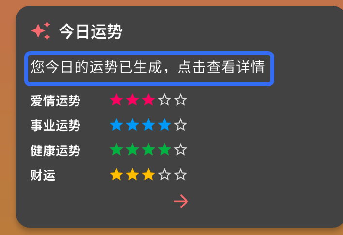

下面是在前述 PRD 基础上，将整个 APP 的开发周期分阶段、逐步完善的版本规划示例，供团队在迭代开发中参考：

---

## 开发版本规划

### **版本 1.0 – MVP（最小可行产品）**

- **核心功能：**

  - **用户登录/注册**：仅支持 Gmail 和微信 OAuth 登录。
  - **个人信息填写**：必填基本信息（姓名、性别、出生日期、出生时间、出生地点）。
  - **首页展示**：
    - 显示当前功德值。
    - 木鱼敲击交互（基本动画及功德值增加逻辑）。
    - 今日运势入口。
  - **今日运势生成**：
    - 根据用户功德值与个人信息，调用 OpenAI API（默认系统密钥）生成运势文本。
  - **数据存储**：实现用户信息、功德值记录、运势记录的基本数据库设计与数据流逻辑。
- **目标：**

  - 建立基本数据模型与接口。
  - 完成前后端的最基本联调，确保核心流程（登录、信息提交、木鱼交互、运势生成）正常运行。
  - 实现 MVP 核心功能，为后续扩展打下基础。

---

### **版本 1.1 – 功能扩展与用户体验优化**

- **新增与优化：**

  - **设置/个人中心页面**：
    - 增加用户自定义 OpenAI API 密钥输入与存储功能（加密保存）。
    - 调整并优化用户信息管理、账号设置与主题切换（夜间模式、字体大小调节）。
    - 首页新增 爱情、事业、健康、财运四个方面的运势 以⭐️表示，0颗星表示极不好，五颗星表示很好。
    - 功德值放于页面右上方
    - 木鱼最下方
    - 四个方面运势放置在中间
  - **数据流调整**：
    - 根据用户是否输入自定义 API 密钥，动态选择调用逻辑（自有密钥或默认密钥）。
    - 项目增加版本文件以记录版本
  - **UI 细节优化**：
    - 提升木鱼动画效果与交互反馈，完善首页视觉层次。
  - **错误处理**：
    - 针对 OpenAI API 调用异常添加重试及错误提示机制。
- **目标：**

  - 提升整体用户体验，满足用户个性化需求。
  - 加强数据传输与错误处理逻辑，确保系统稳定性。

---

### **版本 1.2 – 模块完善与数据丰富**

- **新增与完善：**

  - 主页下拉即可更新运势，不需要手动点击，或者功德值每增加10 更新运势
  - 主页分别展示 当前功德值，今日运势 木鱼
  - 使用openai 调用大模型预测今日运势 以及相应解读，实现真正的实时预测
  - **历史记录与收藏功能**：

    - 增加运势记录的列表或日历视图展示。
    - 实现收藏、筛选与搜索功能，便于用户对比与查询历史数据。
  - **运势详情页扩展**：

    - 分模块展示详细运势（爱情、事业、健康、财运等），并提供相应建议和数据图表（如趋势图）。
    - 根据openai 的API预测 需要做的事情 和不应该做的事情用来改善运势 需要积极向上，偶尔可以加一些心灵鸡汤
  - **第三方信息集成**：

    - 集成天气数据 API、节日信息等外部数据，丰富“今日信息”来源。
  - **数据统计与反馈**：

    - 增加基础的数据统计分析功能，为后续产品优化提供依据。
  - **提高主要美观程度**:

    - 使用木鱼icon, (assets/muyu.png)
    - 点击木鱼成熟+1 效果
    - 合并木鱼和功德值的部分
- **BUG:**

  - [X] 解决openai API返回的运势详情正常显示
    
  - [X] 点击 刷新运势 之后调用API 重新生成运势
  - [X] 增加API调用后的console log 以用来更好debug
  - [ ] 点击红心之后 今日宜做和今日忌做为空
  - [ ] 
- **目标：**

  - 丰富产品功能，使用户能查看历史记录并对预测结果进行多角度对比。
  - 增强预测内容的权威性与互动性。

---

### **版本 1.3 – 模块完善**

- UI

  - 主页
    - 敲击木鱼有+1 效果
    - 主页今日运势有个简短的总结
    - 生成八字运势 有生日信息，和转化之后的生辰八字还有今日天气
  - 运势页
    - 点击运势页进入详细运势页面
    - 运势页面分成一个综合页和四个子页面
      - 详细介绍一下的内容。并且每一项内容，用户可以选择答题，用来补充历史信息，比如爱情的历史信息。这些问题通过api 调用根据个人信息随机生成
        - 爱情
        - 事业
        - 健康
        - 财运
    - 积德页
      - 新增积德页
        这页主要是让用户积累功德使用。积累功德有以下集中方式
        - 敲击木鱼 每日增加最多功德108
        - 随机掉落功德 0-36（根据个人信息和天气信息选择随机掉落功德)，每日掉落一次
        - 自省 用户选择回答问题，反省今天的工作学习社交爱情等等，做得好的可以增加功德 最多增加36  调用API 根据个人信息和回答的问题以及答案，预测增加的功德。答案也是根据个人信息和今日信息调用API进行随机生成，生成5个
- 功能

  - 保存用户历史信息
    - 用户在回答问题补充历史信息时，把这些信息保存在本地

---

### **版本 1.4 – 完善UI**

- UI
  - 今日运势这里 总结一句综合的运势
    - 
  - 主页点击今日运势卡片 直接跳转到运势页而不是提示
  - 运势页
    - 去掉反馈问题卡片
    - 爱情，事业健康，财运都去掉反馈问题卡片
    - 爱情，事业，健康，财运增加一个按钮 ，点击之后，调用openai API 随机生成关于自身和爱情，事业，健康，和财运相关的问题，以补充过去的人生信息。比如“你去年的财运怎么样"， ”你什么时候遇到了挫折"。并且把用户的回答保存到数据库里。后续openai调用的时候，也会参考这些信息
    - 增加运势曲线 纵轴是运势值  横轴是时间默认周期是过去一个月，同时会有未来五天运势的预测值，用虚线表示。四条曲线放在同一个图上，分别表示爱情，事业，健康，财运。本地增加一个虚拟的运势值数据用来展示运势曲线
  - 爱情，事业，健康，财运 都增加一个“宜” 和"忌” 卡片 分别表示为了增加对应财运应该做的 以及不应该做的，这些事情也是根据API调用产生的，需要诙谐幽默 同时能够砥砺人心，触动
  - 积德页
    - 每日自省改为一个按钮，点击这个按钮会触发一个弹窗来回答openai 生成的关于自身的问题，总共五个，和个人相关，同时这个问题又能深刻得反省自己这一天过得怎么样。同时显示进度。回答完五个问题，结算获得的功德值
  - 设置页
    - 设置页改为个人中心
    - 个人中心除了已有的信息还包括个人信息
    - 个人信息
      - 比如出生日期和对应的天干地支
      - 星座
      - 血型
      - 哪里人
      - 性别
      - 偶像，喜欢的人
      - 学历
      - 兴趣
- 功能
  - 在调用API的时候 除了身份信息也会加上保存的历史信息一起调用API 进行预测
  - 运势页运势评分 保留以为小时，值从0.0 到5.0分别对应0颗星到五颗星
  - 今日宜做 和今日忌做 也是调用openai 的API 生成对应应该做的和不应该做的，应该做的和不应该做的需要有趣，比如做一张3年高考五年模拟
- bug
  - 今日宜做 和今日忌做没有显示内容

### 版本1.5 - 增加命运指引按钮

- 功能
  - 在主页增加一个命运指引按钮
  - 当用户遇到一个问题需要抉择的时候可以按这个按钮
  - 点击这个按钮 询问用户遇到了什么问题
  - 如果是选择的问题，根据问题本身，运势，占卜结果给出用户的答案

## 版本迭代原则

- **从核心到丰富**：先实现基本功能，再逐步增加高级功能，确保每个版本都是可运行、可验证的产品。
- **用户反馈驱动**：每个版本发布后，收集用户反馈作为后续迭代的重要依据。
- **安全与稳定性优先**：在功能扩展的同时，始终保持数据安全、接口稳定和用户体验流畅。

---

通过分阶段的版本迭代开发，团队可以逐步构建、验证并优化整个运势预测 APP，使产品在保证稳定性的基础上不断丰富功能、提升体验，最终实现从 MVP 到成熟产品的转变。
