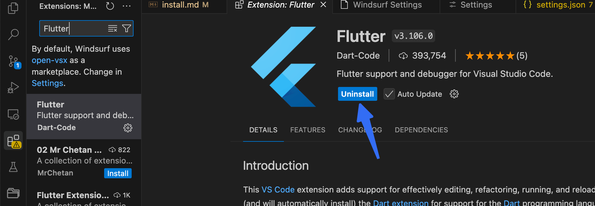
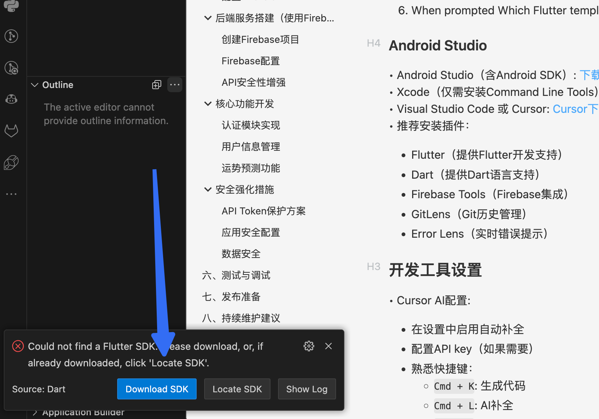
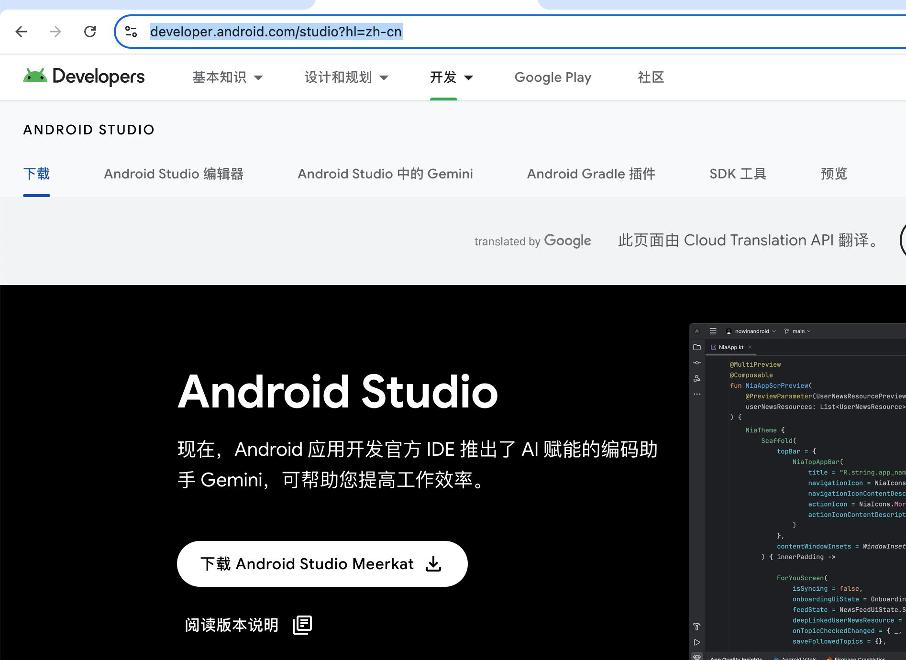
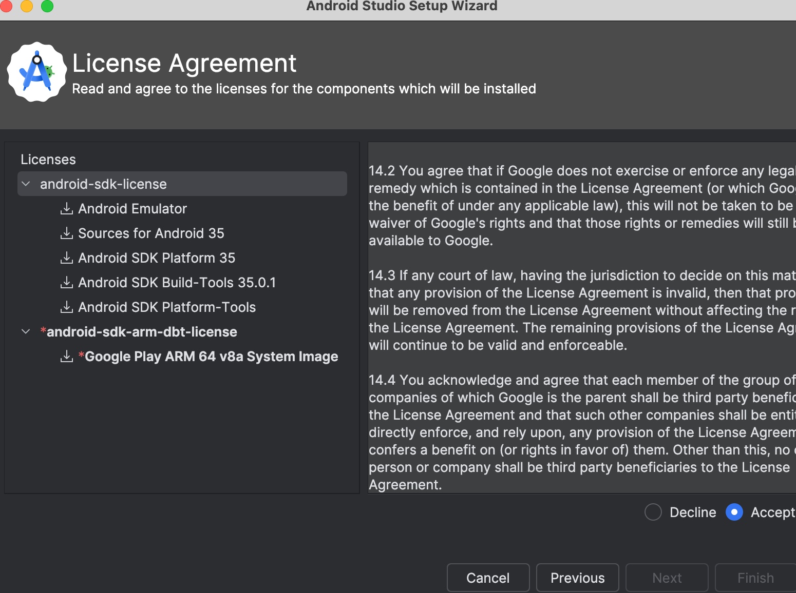
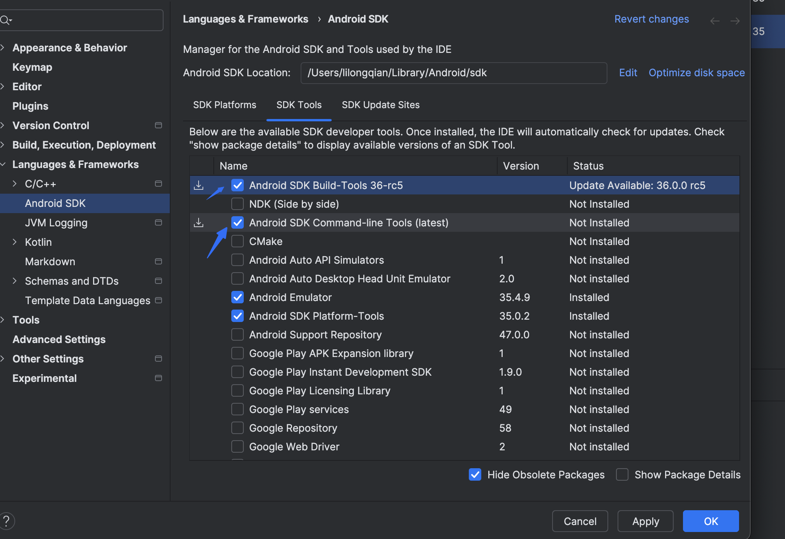
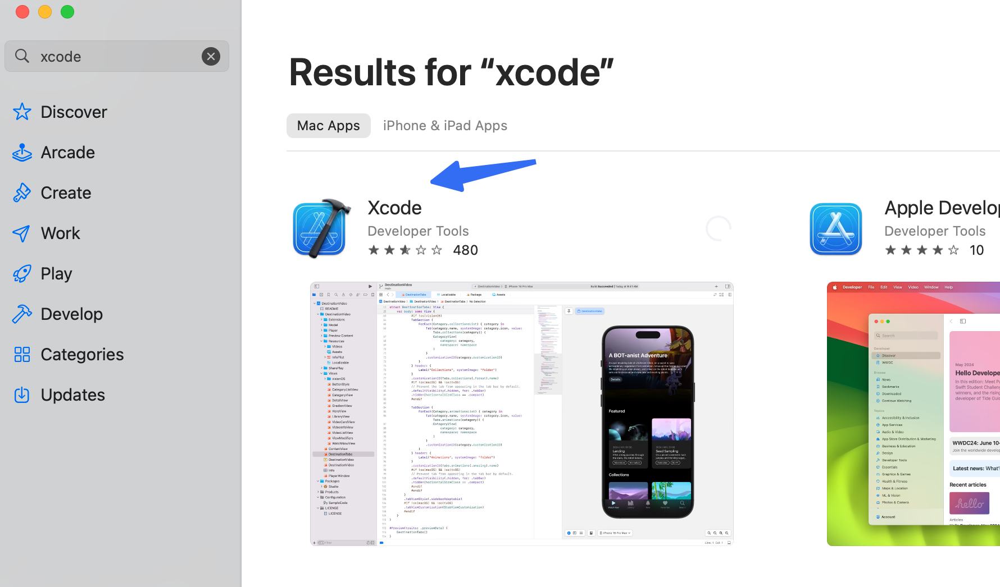
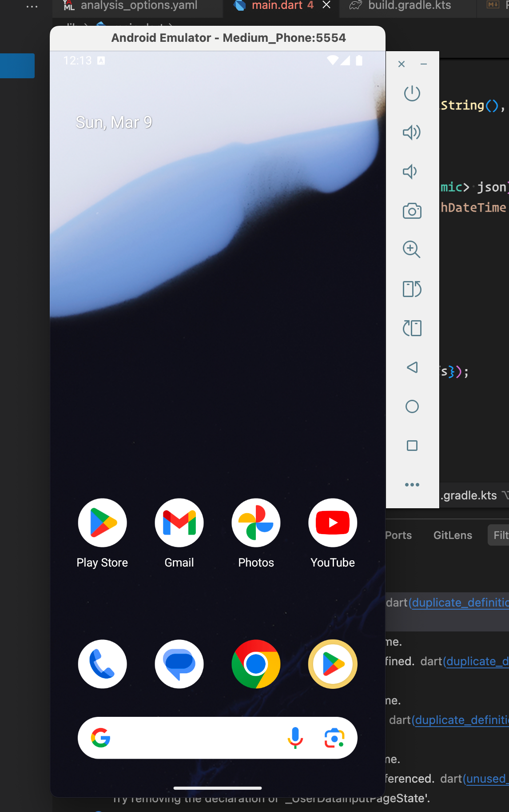

# Tutorial

## environment prepare
### necessary software

#### Flutter SDK

Follow the tutorial in https://docs.flutter.dev/get-started/install/macos/mobile-android

Check and set zsh as default

To verify zsh was set as the default macOS shell, run the Directory Services command line utility.

```bash
dscl . -read ~/ UserShell
```

The command should print the following as its response.

```bash
UserShell: /bin/zsh
```

You can skip the remaining steps.

If you need to install zsh, follow the procedure in this Wiki.

If you need to change your default shell to zsh, run the chsh command.

```bash
chsh -s `which zsh`
```

Some Flutter components require the Rosetta 2 translation process on Macs running Apple silicon. To run all Flutter components on Apple silicon, install Rosetta 2.

```bash
sudo softwareupdate --install-rosetta --agree-to-license
```

We use vs-code to install flutter SDK.

To install Flutter using these instructions, verify that you have installed Visual Studio Code 1.86 or later and the Flutter extension for VS Code.

##### Install the Flutter first



##### Prompt VS Code to install Flutter

1. Launch VS Code.
2. To open the Command Palette, press `Command + Shift + P.`
3. In the Command Palette, type `flutter`.
4. Select Flutter: New Project.
5. VS Code prompts you to locate the Flutter SDK on your computer.

   1. If you have the Flutter SDK installed, click Locate SDK.
   2. If you do not have the Flutter SDK installed, click Download SDK.
   3. This option sends you the Flutter install page if you have not installed Git as directed in the development tools prerequisites.
6. When prompted Which Flutter template?, ignore it. Press `Esc`. You can create a test project after checking your development setup.

   Add path of flutter into the path environment

   Edit in the ~/.zshrc

   ```
   export PATH="/Users/lilongqian/flutter/bin:$PATH"

   ```

#### Android Studio

• Android Studio（含Android SDK）: [下载地址](https://developer.android.com/studio?hl=zh-cn)


Need to install

* **Android SDK Platform, API 35.0.2**
* **Android SDK Command-line Tools**
* **Android SDK Build-Tools**
* **Android SDK Platform-Tools**
*
* **Android Emulator**

  

  * 进入菜单栏的  **Tools > SDK Manager** 。
  * 在 **SDK Tools** 选项卡中勾选以下内容：

    * **Android SDK Command-line Tools (latest)**
    * **Android SDK Build-Tools**
  * 点击 **Apply** 按钮，安装完成后重启 Android Studio

  #### Agree to Android licenses

  Before you can use Flutter and after you install all prerequisites, agree to the licenses of the Android SDK platform.


  1. Open an elevated console window.
  2. Run the following command to enable signing licenses.

     ```
     flutter doctor --android-licenses
     ```

     If you accepted the Android Studio licenses at another time, this command returns:

     ```
     [========================================] 100% Computing updates...
     All SDK package licenses accepted.
     ```

     You can skip the next step.
  3. Before agreeing to the terms of each license, read each with care.

#### Xcode（仅需安装Command Line Tools）

通过App Store安装


• 推荐安装插件：

- Flutter（提供Flutter开发支持）
- Dart（提供Dart语言支持）
- Firebase Tools（Firebase集成）
- GitLens（Git历史管理）
- Error Lens（实时错误提示）

Final check the flutter environment

```bash
(base) lilongqian@Qian-Lilong ~ % flutter doctor

Doctor summary (to see all details, run flutter doctor -v):
[✓] Flutter (Channel stable, 3.29.1, on macOS 15.3.1 24D70 darwin-arm64, locale en-GB)
[✓] Android toolchain - develop for Android devices (Android SDK version 35.0.1)
[✓] Xcode - develop for iOS and macOS (Xcode 16.2)
[✓] Chrome - develop for the web
[✓] Android Studio (version 2024.3)
[✓] Connected device (3 available)
[✓] Network resources

• No issues found!
```

If got issue, `ERROR:  Error installing cocoapods:`, we need to install
`cocoapods` with the following commands

```bash
brew install ruby
sudo gem install cocoapods
pod setup
```

## 📱 预览 Flutter App 方法
### 方法 1：在 Android 模拟器上预览

#### 1. 启动 Android 模拟器
如果你已经正确安装了 **Android Studio**  并设置了 **AVD（Android Virtual Device）** ，可以使用以下方法启动模拟器：

#####  **方式 1（使用 Android Studio 启动）** ：

  - 打开 **Android Studio** ，点击 **"Tools" → "AVD Manager"** 。

  - 选择一个 **虚拟设备** ，点击 **"启动"（Start）** 。

#####  **方式 2（使用终端启动）** ：
运行以下命令：
```bash
emulator -avd YourEmulatorName
```

⚠️ 如果 `emulator` 命令找不到，请先检查 Android SDK 的 `PATH` 设置，具体见 [如何解决 zsh: command not found: emulator](https://chatgpt.com/c/67cc6765-a118-8001-b83d-4524f6e721e9#%E8%A7%A3%E5%86%B3%E6%96%B9%E6%B3%95-2%EF%BC%9A%E6%A3%80%E6%9F%A5-android-sdk-%E8%B7%AF%E5%BE%84) 。**

会弹出一个显示屏幕



#### **在模拟器上运行 Flutter App**

在你的 Flutter 项目目录下，运行：


```bash
flutter run
```


如果只有一个可用设备，它会自动运行应用。如果有多个设备，请使用：


```bash
flutter run -d emulator-5554  # 设备 ID 可能不同，使用 flutter devices 查看
```


你的 Flutter App 应该会启动，并在模拟器上显示！


### 方法 2：在 Android 真机上预览
**1. 连接 Android 设备**

- 用 **USB 线** 连接你的 Android 设备到 Mac。

- 在 Android 设备上：

  - 进入 **"设置" → "关于手机"** 。

  - 连续 **点击 7 次 "版本号"** ，启用 **开发者模式** 。

  - 在 **"开发者选项"**  中，打开 **USB 调试** 。

**2. 检查设备是否连接**

运行：


```bash
flutter devices
```


如果你的设备成功连接，你会看到类似：


```arduino
1 connected device:
Pixel 6 (mobile) • 192.168.1.2:5555 • android-arm64
```

**3. 运行 Flutter App**

运行：


```bash
flutter run
```


或者，指定设备 ID：


```bash
flutter run -d 192.168.1.2:5555
```


你的 App 将直接运行在 Android 设备上。


---


### 方法 3：在 iOS 模拟器上预览（仅限 macOS
**⚠️ 需要 macOS，并安装 Xcode**
**1. 启动 iOS 模拟器**

运行：


```bash
open -a Simulator
```


或者：


```bash
flutter emulators --launch apple_ios_simulator
```

**2. 运行 Flutter App**


```bash
flutter run -d iPhone
```


如果你的项目支持 iOS，它会自动编译并运行。


---


### 方法 4：在 iPhone 真机上预览（需要 Apple 开发者账户）
**1. 连接 iPhone**

- 用 **USB 线** 连接 iPhone 到 Mac。

- 运行：


```bash
flutter devices
```

确保你的 iPhone 出现在列表中。

**2. 在 iPhone 上运行**


```bash
flutter run -d YOUR_DEVICE_ID
```

**⚠️ 如果出现 "iOS app cannot run on device"** ，请打开 `ios/Runner.xcworkspace` 在 Xcode 中进行 **真机签名** 。


---


### 方法 5：使用 Web 预览（适用于简单 UI 测试）

如果你只是想简单预览 UI（不涉及 Android/iOS 设备），可以运行：

```bash
flutter run -d chrome
```


**🔥 总结**
| 运行方式 | 适用设备 | 适用场景 |
| --- | --- | --- |
| flutter run | Android 模拟器 | Android 端调试 |
| flutter run -d <device_id> | Android 真机 | 真机测试 |
| flutter run -d iPhone | iOS 模拟器 | iOS 端调试 |
| flutter run -d <iPhone_device_id> | iPhone 真机 | 真机测试（需 Apple 账户） |
| flutter run -d chrome | 浏览器 | Flutter Web 预览 |


!!! note ""
     VS Code 运行 main.dart 和 使用 flutter run 运行 Flutter 项目 的本质是一样的，都是从 lib/main.dart 开始执行。但它们在 使用方式和功能 上有一些不同：


## 项目初始化

### 创建Flutter项目

```bash
flutter create fortune_teller
cd fortune_teller
```

### 配置Android

• 打开Android Studio → 配置最低SDK版本21
• 修改android/app/build.gradle中的applicationId

## 后端服务搭建（使用Firebase）

### 创建Firebase项目

• 访问[Firebase Console](https://console.firebase.google.com/)
• 创建新项目步骤：

1. 点击"创建项目"
2. 输入项目名称
3. 选择是否启用Google Analytics
4. 选择Analytics账号

### Firebase配置

• 启用认证服务：

1. 在左侧菜单选择"Authentication"
2. 点击"开始使用"
3. 启用以下登录方式：
   - 邮箱/密码
   - Google登录
   - 微信登录（需要微信开放平台账号）


• 配置Firestore数据库：

1. 选择"Firestore Database"
2. 创建数据库
3. 选择测试模式或生产模式
4. 选择地理位置（建议asia-east1）

### API安全性增强

```javascript
// 在Firebase Functions中实现API代理
exports.getLLMPrediction = functions.https.onCall(async (data, context) => {
  // 验证用户身份
  if (!context.auth) {
    throw new functions.https.HttpsError('unauthenticated', '需要登录');
  }

  // 验证请求频率
  const userDoc = await admin.firestore()
    .collection('users')
    .doc(context.auth.uid)
    .get();

  const lastRequestTime = userDoc.data()?.lastRequestTime?.toDate() || 0;
  const now = new Date();

  if (now - lastRequestTime < 60000) { // 1分钟限制
    throw new functions.https.HttpsError('resource-exhausted', '请求过于频繁');
  }

  // 从安全存储获取API密钥
  const apiKey = await admin.secretManager().getSecret('llm-api-key');

  try {
    const response = await axios.post('https://api.example.com/v1/predict', {
      user_data: data.birthInfo,
      timestamp: now.toISOString()
    }, {
      headers: {
        'Authorization': `Bearer ${apiKey}`,
        'X-Request-ID': context.auth.uid,
      }
    });

    // 更新用户最后请求时间
    await userDoc.ref.update({
      lastRequestTime: admin.firestore.FieldValue.serverTimestamp()
    });

    return response.data;
  } catch (error) {
    console.error('API调用失败:', error);
    throw new functions.https.HttpsError('internal', '预测服务暂时不可用');
  }
});
```

## 核心功能开发

### 认证模块实现

```dart
// 实现Google登录
Future<UserCredential> signInWithGoogle() async {
  final GoogleSignInAccount? googleUser = await GoogleSignIn().signIn();
  final GoogleSignInAuthentication? googleAuth = await googleUser?.authentication;
  return await FirebaseAuth.instance.signInWithCredential(
    GoogleAuthProvider.credential(
      accessToken: googleAuth?.accessToken,
      idToken: googleAuth?.idToken,
    ),
  );
}

// 微信登录需要额外配置（需使用插件flutter_wechat_auth）
```

### 用户信息管理

```dart
// 上传头像
Future<void> uploadAvatar(File image) async {
  final ref = FirebaseStorage.instance
      .ref('avatars/${FirebaseAuth.instance.currentUser!.uid}');
  await ref.putFile(image);
  final url = await ref.getDownloadURL();
  await FirebaseFirestore.instance.collection('users')
      .doc(FirebaseAuth.instance.currentUser!.uid)
      .update({'avatarUrl': url});
}
```

### 运势预测功能

```dart
Future<String> getFortunePrediction(BirthInfo birthInfo) async {
  final result = await FirebaseFunctions.instance
      .httpsCallable('getHoroscope')
      .call({
        'birthday': birthInfo.toJson(),
        // 其他必要参数...
      });
  return result.data['prediction'];
}
```

## 安全强化措施

### API Token保护方案

• 使用Firebase的Security Rules控制数据库访问
• 实现Token轮换机制：

```javascript
  // 在Cloud Functions中实现
  exports.rotateApiToken = functions.pubsub.schedule('every 24 hours').onRun(async (context) => {
    const newToken = generateSecureToken();
    await admin.secretManager().updateSecret('llm-api-key', newToken);
  });
```

### 应用安全配置

• 启用SSL证书固定（Certificate Pinning）
• 实现设备指纹验证
• 添加请求签名验证

### 数据安全

• 实现端到端加密：

```dart
  // 使用 encrypt 包进行数据加密
  final encrypter = Encrypter(AES(key));
  final encrypted = encrypter.encrypt(sensitiveData, iv: iv);
```

• 敏感数据处理：

```dart
  // 使用 flutter_secure_storage 存储敏感信息
  final storage = FlutterSecureStorage();
  await storage.write(key: 'user_token', value: token);
```

# 六、测试与调试

1. 安卓设备测试

```bash
flutter run -d emulator-5554
```

2. 常用调试技巧
   • 使用Flutter DevTools分析性能
   • 添加--release标志进行生产环境测试
   • 使用flutter_test包编写单元测试

# 七、发布准备

1. 构建APK

```bash
flutter build apk --release
```

2. Google Play发布流程
   • 创建[开发者账号](https://play.google.com/console)
   • 准备材料：
   • 512x512像素应用图标
   • 1024x500像素特色图片
   • 隐私政策声明（需包含用户数据处理说明）
   • 屏幕截图（至少2张）
3. 微信登录特别要求
   • 需要提供微信开放平台的审核材料
   • 配置应用签名（使用SHA-256证书指纹）

# 八、持续维护建议

1. 错误监控
   • 集成Firebase Crashlytics:

```yaml
  # pubspec.yaml
  dependencies:
    firebase_crashlytics: ^latest_version
```

```dart
  // main.dart
  void main() async {
    WidgetsFlutterBinding.ensureInitialized();
    await Firebase.initializeApp();
    FlutterError.onError = FirebaseCrashlytics.instance.recordFlutterError;
    runApp(MyApp());
  }
```

2. 性能监控
   • 添加Firebase Performance Monitoring
   • 实现自定义跟踪点
   • 监控关键用户行为
3. 用户反馈收集
   • 集成应用内反馈系统
   • 实现崩溃报告自动收集
   • 添加用户行为分析
4. 版本更新策略
   • 实现强制更新机制
   • 配置增量更新
   • 建立更新通知系统

# 九、开发流程建议（适合新手）

1. 环境搭建（1-2天）
   • 按照上述步骤完成所有工具安装
   • 运行flutter doctor确保无错误
   • 创建测试项目验证环境
2. 基础功能开发（3-5天）
   • 完成用户界面设计
   • 实现基础导航功能
   • 集成Firebase基础服务
3. 认证系统（3-4天）
   • 实现邮箱登录
   • 添加社交媒体登录
   • 完成用户信息管理
4. 核心功能（5-7天）
   • 集成大模型API
   • 实现运势预测逻辑
   • 添加用户个性化功能
5. 测试与优化（3-4天）
   • 进行单元测试
   • 执行集成测试
   • 性能优化
6. 发布准备（2-3天）
   • 准备应用商店材料
   • 完成隐私政策
   • 构建发布版本

总计预估时间：约3周
